<div align="center">


<br/>


&nbsp;

&nbsp;


</div>

---

## `$ whoami`

```python
class LakshmiPravalika:
    degree     = "B.Tech — CS (Cybersecurity & Blockchain Technology)"
    focus      = ["Cybersecurity", "AI/ML", "Full-Stack Dev", "DevOps"]
    currently  = ["AI Agents", "Secure System Design", "MLOps"]
    open_to    = ["Internships", "Open Source", "Collaborations"]
    fun_fact   = "I debug at 2AM and call it productivity 🌙"
```

---

## `$ cat areas_of_work.txt`

<div align="center">

| Domain | What I Build |
|:---:|---|
| 🔐 **Cybersecurity** | Phishing detectors, adaptive security, threat analysis systems |
| 🤖 **AI / ML** | GenAI apps, medical imaging AI, NLP, recommendation engines |
| 🌐 **Full-Stack** | React + FastAPI/Node.js apps, e-commerce, management systems |
| ⚙️ **DevOps / MLOps** | Docker, Jenkins, CI/CD pipelines, FastAPI model serving |
| 🏥 **AI for Healthcare** | Deep learning on X-ray imaging, patient data systems |

</div>

---

## `$ cat tech_stack.json`

<div align="center">

**Languages**

[](https://skillicons.dev)

**Frontend & Backend**

[](https://skillicons.dev)

**Databases & Cloud**

[](https://skillicons.dev)

**DevOps & Tools**

[](https://skillicons.dev)

</div>

---

## `$ ./github_stats.sh`
<div align="center">


</div>


<br/>

<!-- Manual language breakdown — always accurate regardless of GitHub detection -->


</div>

---

## `$ git log --graph --oneline`

<div align="center">

[](https://github.com/ashutosh00710/github-readme-activity-graph)

</div>

---

## `$ ls -la featured_projects/`

<div align="center">

<table>
<tr>
<td width="50%">

### 🔐 PhishShield
Intelligent phishing URL detection using ML pattern recognition. Focus on practical cybersecurity tooling.

`Python` `ML` `Security`

[](https://github.com/LakshmiPravalika79/PhishShield)

</td>
<td width="50%">

### 🏥 LumbarVertebrae X-ray Analyzer
AI-based deep learning model for spinal X-ray medical image analysis.

`Python` `Deep Learning` `Healthcare`

[](https://github.com/LakshmiPravalika79/LumbarVertebrae-X-ray-Analyzer)

</td>
</tr>
<tr>
<td width="50%">

### 🤖 AI Student Support System
GenAI-powered academic assistant for personalized student guidance and queries.

`GenAI` `NLP` `FastAPI`

[](https://github.com/LakshmiPravalika79/AI-powered-Intelligent-Student-Support-System)

</td>
<td width="50%">

### 📊 Auto PPT Agent
AI agent that auto-generates presentations from content using GenAI.

`AI Agent` `GenAI` `Automation`

[](https://github.com/LakshmiPravalika79/Auto_PPT_Agent)

</td>
</tr>
<tr>
<td width="50%">

### 🚗 Vayuv AutoSentry
AI-powered vehicle monitoring and real-time anomaly detection system.

`AI` `IoT` `Safety`

[](https://github.com/LakshmiPravalika79/vayuv-autosentry-ey-techathon-6.0)

</td>
<td width="50%">

### ⚙️ MLOps FastAPI Docker Deployment
End-to-end ML model serving with FastAPI + Docker. Covers scalable API design and deployment pipelines.

`MLOps` `Docker` `FastAPI`

[](https://github.com/LakshmiPravalika79/MLOPS_FastAPI_Docker_Deployment_Calibo_training)

</td>
</tr>
</table>

</div>

<details>
<summary><b>📂 View All Projects</b></summary>

<br/>

| Project | Description | Stack |
|---|---|---|
| [🛒 FreshMart](https://github.com/LakshmiPravalika79/FreshMart) | GenAI retail — smart recommendations & bundle suggestions | React, AI |
| [🚗 ShieldRide](https://github.com/LakshmiPravalika79/shieldride) | Safety-focused ride application | Full-Stack |
| [🏥 Hospital Management](https://github.com/LakshmiPravalika79/Hospital_Management_System) | Full-stack patient, doctor & records management | Java, DB |
| [📦 Inventory Management](https://github.com/LakshmiPravalika79/InventoryManagmentSystem) | Stock tracking and operations management | Full-Stack |
| [📚 AI Notes Generator](https://github.com/LakshmiPravalika79/AI-Notes-Generator) | Auto-generates study notes using AI | GenAI |
| [🌱 E-Plant Shopping](https://github.com/LakshmiPravalika79/e-PlantShopping) | Full-stack e-commerce for plants | React |
| [🏛️ Hyperlocal Governance Engine](https://github.com/DadiBhagyavathi/hyperlocal-governance-engine) | Civic tech for local government operations | Full-Stack |
| [🎟️ Train Ticket System](https://github.com/LakshmiPravalika79/train-ticket-system) | Booking and ticketing system | Full-Stack |
| [🎮 Hangman Game](https://github.com/LakshmiPravalika79/hangman-game) | Classic game built in C | C |
| [⚙️ CI/CD Pipelines](https://github.com/LakshmiPravalika79/cicd-jenkin) | Jenkins + GitHub Actions deployment pipelines | DevOps |
| [🌐 Personal Portfolio](https://github.com/LakshmiPravalika79/personal-portfolio) | My personal developer portfolio | HTML, CSS, JS |

</details>

---

## `$ watch contribution_snake`

<div align="center">


</div>


---

## `$ ping connect`

<div align="center">

[](https://linkedin.com/in/lakshmipravalikaega)
[](mailto:egalakshmipravalika458@gmail.com)
[](https://github.io/LakshmiPravalika79/personal-portfolio)

<br/>

```
╔══════════════════════════════════════════════════════╗
║   Cybersecurity · AI · Blockchain · Full-Stack       ║
║         while(alive) { keep_learning(); }            ║
╚══════════════════════════════════════════════════════╝
```


</div>
